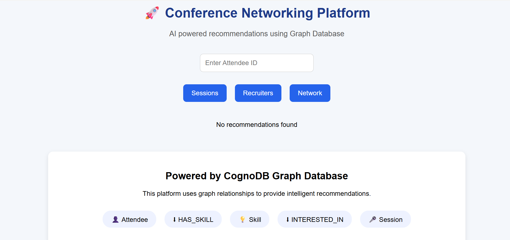
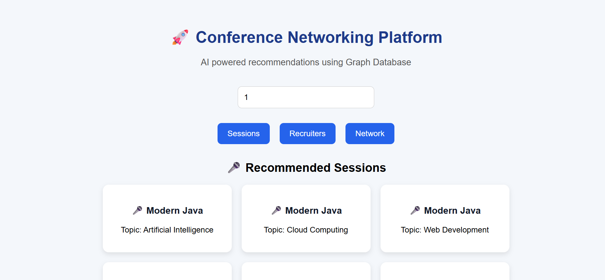
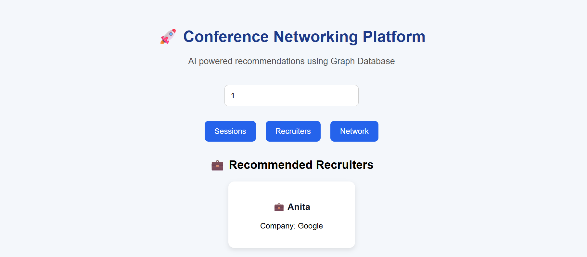
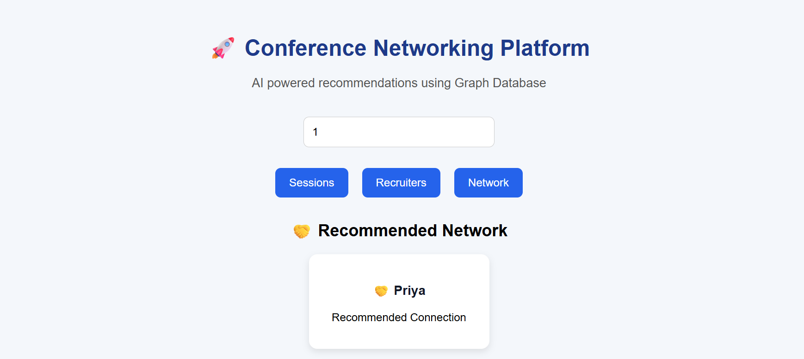

# 🚀 Conference Networking Platform

A full-stack graph database application built using **Spring Boot**, **React**, and **CognoDB**.

This application recommends conference sessions, recruiters, and networking connections by traversing relationships in a graph database.

---

# 📌 Project Overview

The Conference Networking Platform helps conference attendees discover relevant opportunities based on their interests and skills.

Unlike traditional relational databases, this application uses a **graph database** to efficiently traverse relationships between attendees, skills, topics, sessions, recruiters, and companies.

The application provides:

- 🎤 Session Recommendations
- 💼 Recruiter Recommendations
- 🤝 Networking Recommendations


---

The recommendations shown are generated dynamically based on the graph relationships stored in CognoDB. Different attendees may receive different recommendations depending on their skills and interests.

# ✨ Features

## 🎤 Session Recommendation

Recommends conference sessions based on the attendee's interests.

Graph Relationship:

```
Attendee → INTERESTED_IN → Topic ← COVERS ← Session
```

Example Response (Attendee ID = 1)

```json
[
  {
    "sessionName": "Modern Java",
    "topic": "Artificial Intelligence"
  }
]
```

---

## 💼 Recruiter Recommendation

Suggests recruiters hiring for the attendee's skills.

Graph Relationship:

```
Attendee → HAS_SKILL → Skill ← HIRING_FOR ← Recruiter → WORKS_FOR → Company
```

Example Response (Attendee ID = 1)

```json
[
  {
    "recruiterName": "Anita",
    "company": "Google"
  }
]
```

---

## 🤝 Network Recommendation

Suggests attendees with similar skills for networking.

Graph Relationship:

```
Attendee → HAS_SKILL → Skill ← HAS_SKILL ← Attendee
```

Example Response (Attendee ID = 1)

```json
[
  {
    "name": "Priya"
  }
]
```

---

# 🛠 Technology Stack

## Backend

- Java
- Spring Boot
- Maven
- Neo4j Java Driver
- REST APIs

## Frontend

- React
- Vite
- Axios
- CSS

## Database

- CognoDB
- openCypher

---

# 🏗 System Architecture

```
              React Frontend
                    │
                 Axios API
                    │
             Spring Boot Backend
                    │
          Neo4j Java Driver
                    │
          CognoDB Graph Database
```

---

# 📊 Graph Data Model

## Nodes

- Attendee
- Skill
- Topic
- Session
- Recruiter
- Company

## Relationships

```
Attendee -[:HAS_SKILL]-> Skill

Attendee -[:INTERESTED_IN]-> Topic

Topic <-[:COVERS]- Session

Recruiter -[:HIRING_FOR]-> Skill

Recruiter -[:WORKS_FOR]-> Company

Attendee -[:HAS_SKILL]-> Skill <-[:HAS_SKILL]- Attendee
```

---

# 🔗 REST API Endpoints

## Seed Database

```
GET /seed
```

---

## Recommend Sessions

```
GET /recommend/sessions/{attendeeId}
```

Example

```
GET /recommend/sessions/1
```

---

## Recommend Recruiters

```
GET /recommend/recruiters/{attendeeId}
```

Example

```
GET /recommend/recruiters/1
```

---

## Recommend Network

```
GET /recommend/network/{attendeeId}
```

Example

```
GET /recommend/network/1
```

---

# 📂 Project Structure

```
WEXA-AI-Assignment
│
├── backend
│   ├── src
│   ├── pom.xml
│   └── ...
│
├── frontend
│   ├── src
│   ├── package.json
│   └── ...
│
├── screenshots
│   ├── home.png
│   ├── sessions.png
│   ├── recruiters.png
│   └── network.png
│
├── README.md
└── .gitignore
```

---

# ▶️ Running the Project


## Environment Variables

Configure the following environment variables before starting the backend:

| Variable | Description |
|----------|-------------|
| COGNODB_URI | CognoDB Bolt URI |
| COGNODB_USERNAME | CognoDB Username |
| COGNODB_PASSWORD | CognoDB Password |

## Backend

Navigate to the backend folder

```bash
cd backend
```

Run the application

```bash
mvn spring-boot:run
```

Backend runs on

```
http://localhost:8082
```

---

## Frontend

Navigate to the frontend folder

```bash
cd frontend
```

Install dependencies

```bash
npm install
```

Start the application

```bash
npm run dev
```

Frontend runs on

```
http://localhost:5173
```

---

# 📸 Screenshots

## Home Page



---

## Session Recommendation



---

## Recruiter Recommendation



---

## Network Recommendation



---


## Why a Graph Database?

Traditional relational databases require complex JOIN operations to discover relationships between attendees, sessions, recruiters, and skills.

A graph database models these relationships naturally using nodes and relationships, making multi-hop traversals efficient and easier to understand.

Using CognoDB allows the application to quickly recommend sessions, recruiters, and networking opportunities based on connected data.

## Data Model Diagram

```text
(Attendee)
   │
   ├── HAS_SKILL ─────► (Skill)
   │
   ├── INTERESTED_IN ─► (Topic)
                          ▲
                          │ COVERS
                      (Session)

(Recruiter)
      │
HIRING_FOR
      ▼
   (Skill)

(Recruiter)
      │
 WORKS_FOR
      ▼
  (Company)
```

## Setting Up CognoDB

1. Create a CognoDB account.
2. Create a new graph database instance.
3. Copy the Bolt URI, username, and password.
4. Configure the following environment variables:

- COGNODB_URI
- COGNODB_USERNAME
- COGNODB_PASSWORD

5. Run the seed script to populate sample data.

## Main Cypher Queries

### Session Recommendation

Matches attendee interests with session topics.

### Recruiter Recommendation

Finds recruiters hiring for the attendee's skills.

### Network Recommendation

Finds attendees with similar skills.


# 🚀 Future Enhancements

- User Authentication
- Graph Visualization
- Personalized Recommendation Ranking
- Conference Schedule Management
- Chat Between Attendees
- Advanced Multi-hop Recommendations

---

# 👩‍💻 Author

**Lahari**

Developed as part of the **WEXA AI Graph Database Take-Home Assignment**.
